# Nam Nagaram: Participatory Municipal Budgeting (SDG 11)

Ward residents suggest projects, then back **every project they want funded** as long as their picks fit the ward's budget, within a set voting window. The results update live. Every ballot is added to a **hash chain**, so any edit, deletion or inserted ballot is visible to everyone.

> Hackathon prototype · SDG 11 Sustainable Cities & Communities · Flutter + Node.js + Supabase
>
> Tamil Nadu civic look (tricolour strip, kolam patterns, temple-gateway logo). Original artwork: it does **not** use the state emblem, and the app says it is not an official Government of Tamil Nadu service. Regenerate the launcher icons with `flutter test tool/make_icons_test.dart`.

## Screenshots
| Login | Home | Proposal | AI explain |
|---|---|---|---|
| 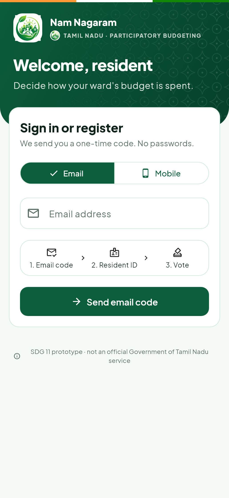 | 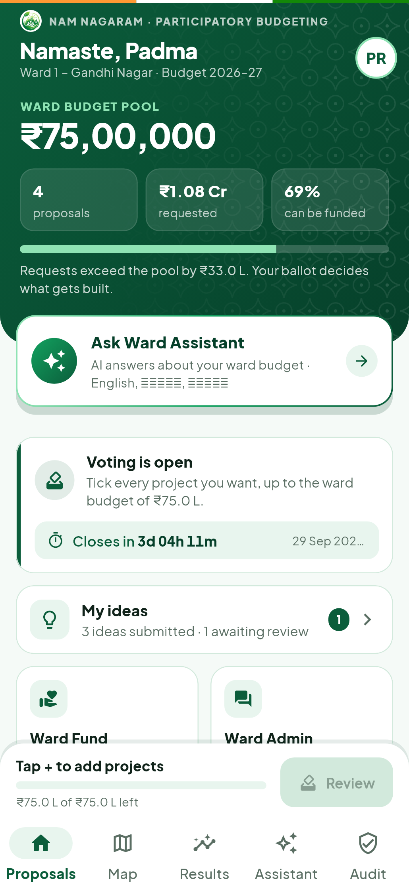 | 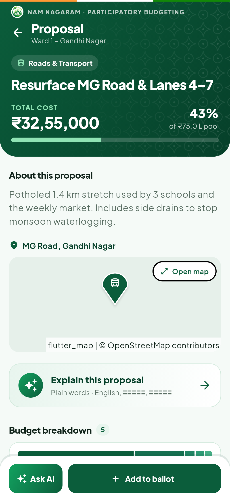 | 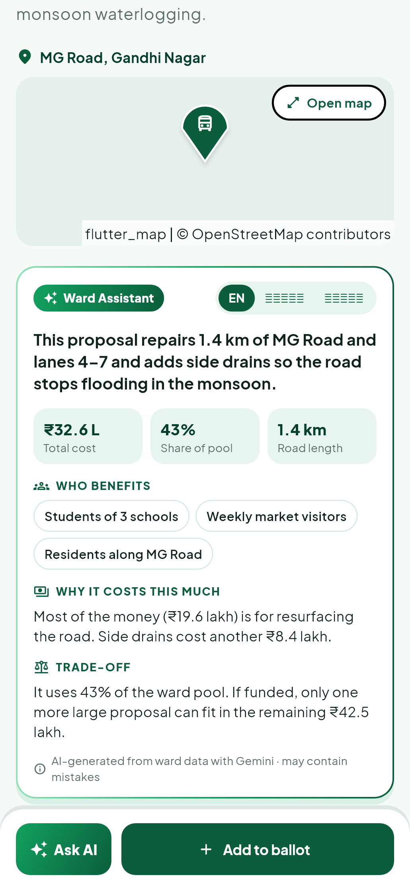 |

| Building a ballot | Ballot review | My ideas | Admin: ideas |
|---|---|---|---|
| 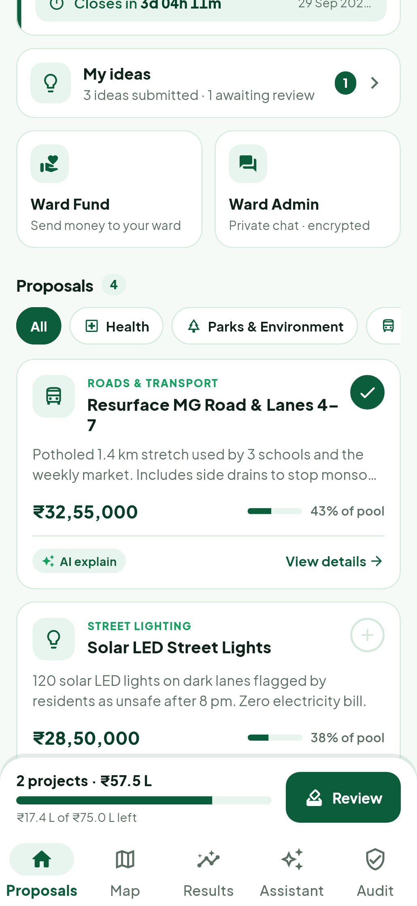 | 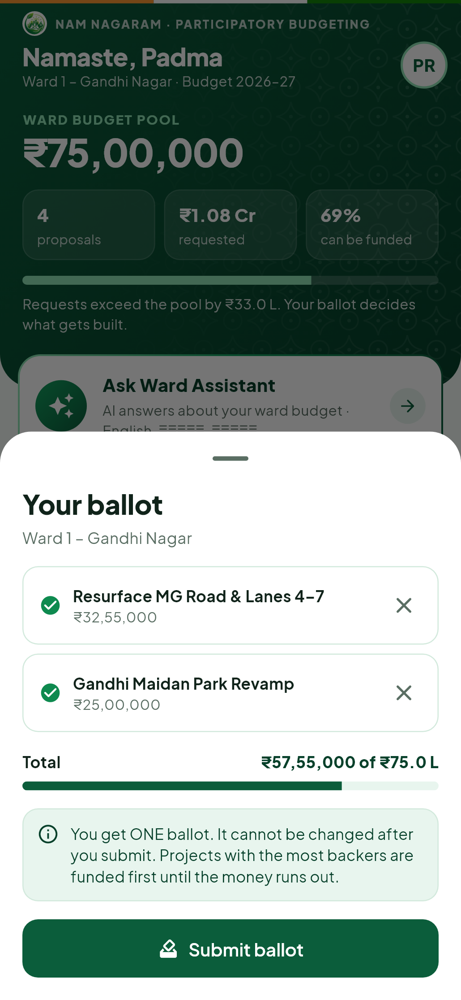 | 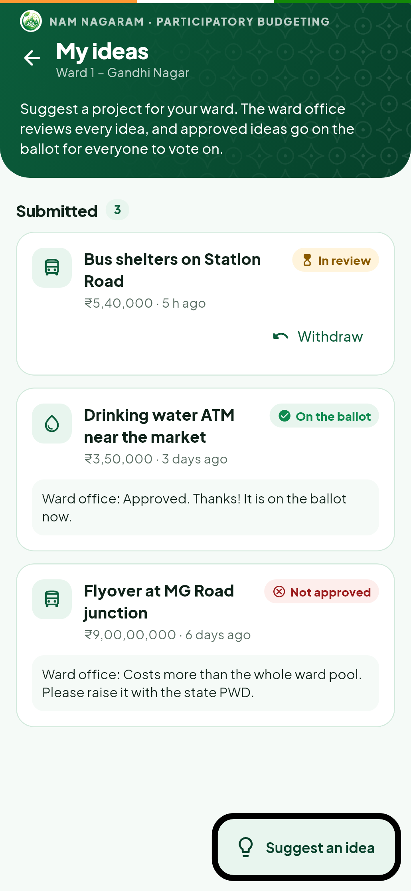 | 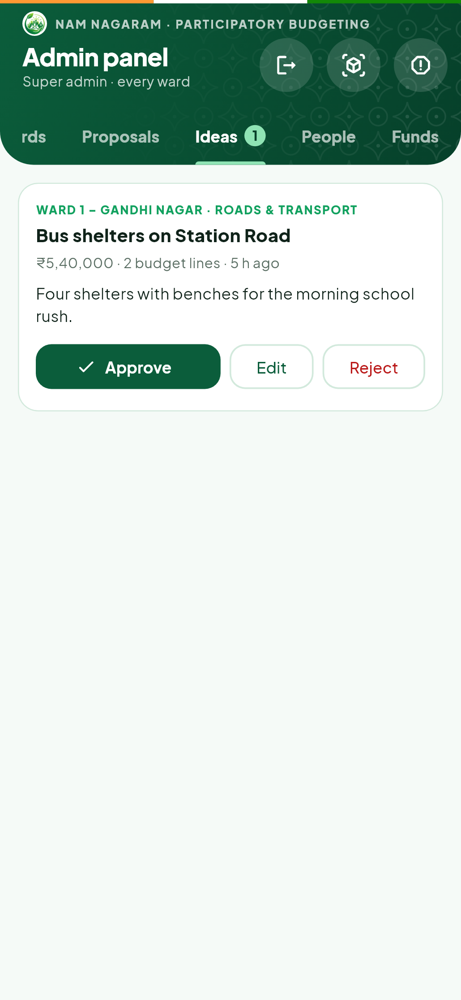 |

| Live results | Ward Assistant | Audit log | Admin: wards |
|---|---|---|---|
| 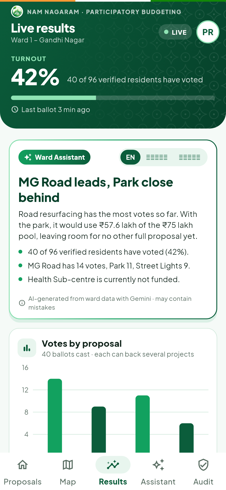 | 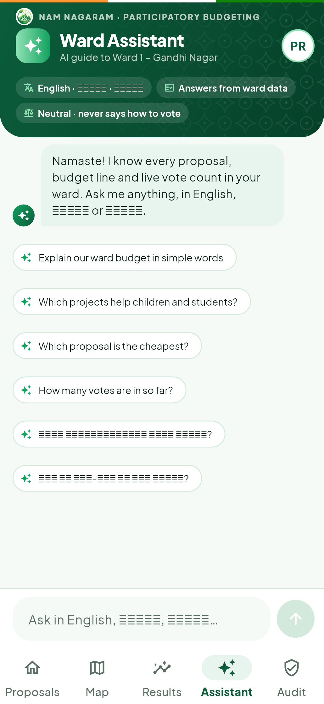 | 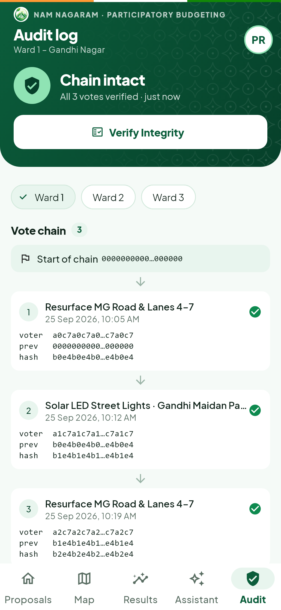 | 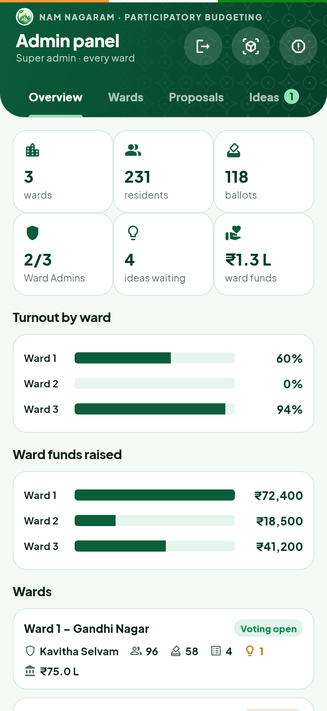 |

> Rendered with sample data by `app/tool/screenshots_test.dart` (`flutter test tool/screenshots_test.dart --update-goldens`).

| 404 | Offline | Voting not open | Already voted |
|---|---|---|---|
| 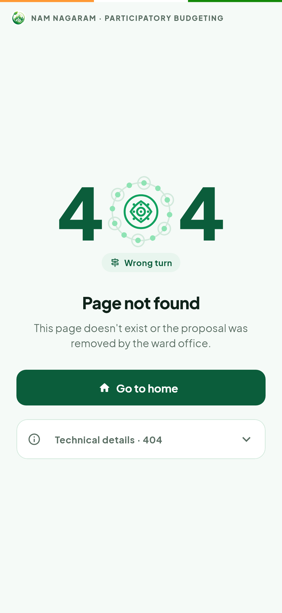 | 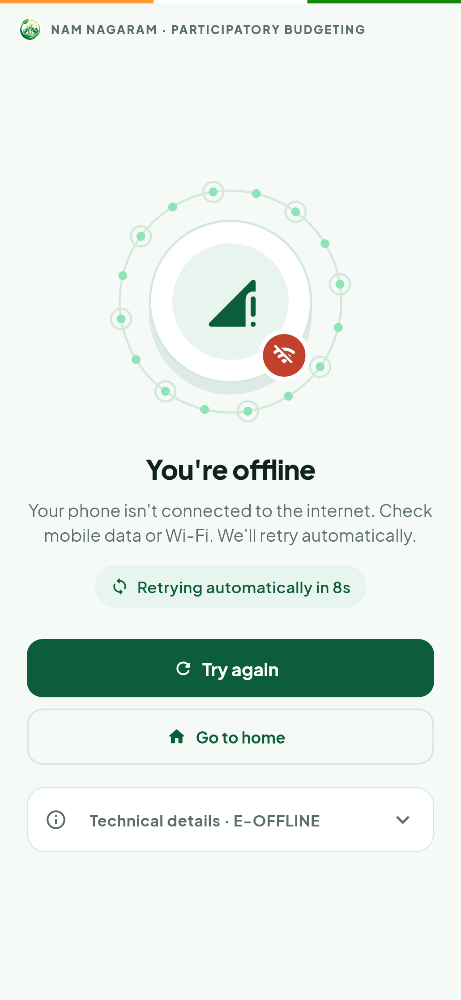 | 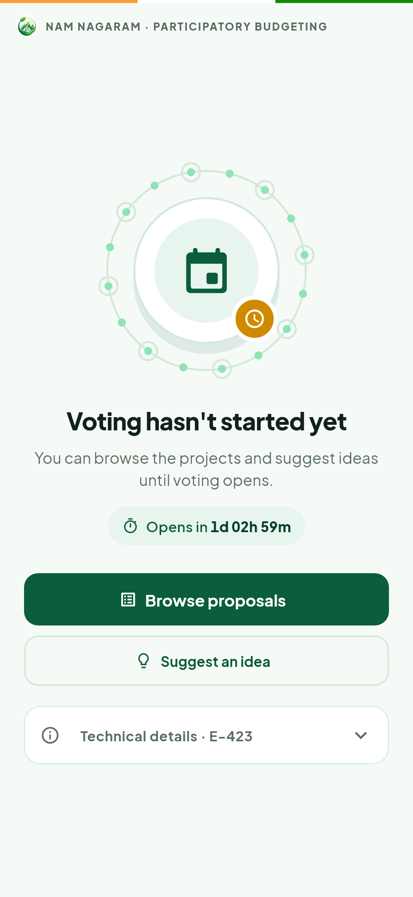 | 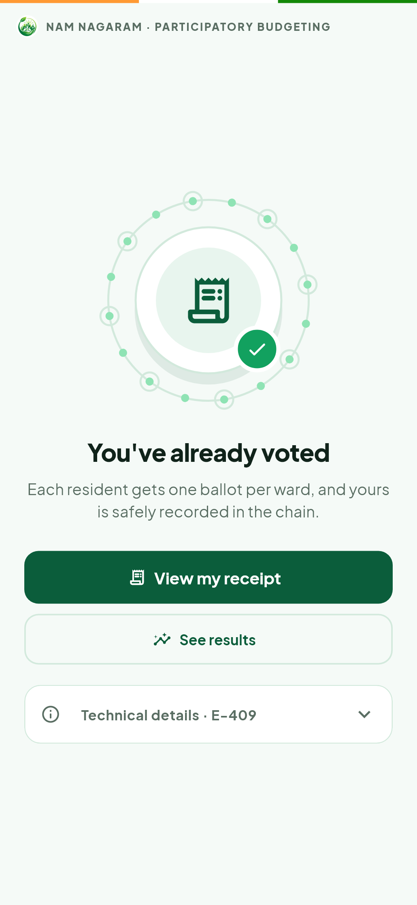 |

## Features
| Area | What it does |
|---|---|
| **Login** | Residents sign in with **one** method of their choice: a 6-digit email code (Supabase Auth) or an SMS code (Fast2SMS). The other contact is **optional**: **Profile → Verification** shows what isn't verified yet with a **Verify** button. Once both are verified, either one signs in to the same account. Codes are stored only as SHA-256 hashes, expire after 5 minutes, allow 3 attempts, can be resent after 60 s and are limited to 5 per hour. An email or number belongs to one account only. |
| **Profile** | Full name, ward (1 of 3), **Resident ID** (simulated verification, one account per ID). |
| **Proposals** | Ward budget pool vs. total requested, category filters, and a detailed budget breakdown in ₹. |
| **Voting window** | Each ward has an opening and a closing time. Home shows a live countdown. Before the window opens the phase is *Upcoming*, and after it closes the results are **final**. The server enforces the window, not only the app. |
| **Split voting** | A resident ticks **as many projects as they like**, as long as the total fits the ward pool. A budget meter shows how much is used. It's **one ballot per resident**, and the server checks the budget cap. |
| **Resident ideas** | Residents submit their own project ideas, with an AI-drafted ₹ breakdown if they want one. An admin approves the idea (it goes on the ballot), edits it, or rejects it with a note the resident can see. |
| **Live results** | Supabase Realtime covers the votes bar chart, the fund-allocation donut and turnout. Admin changes (dates, approvals) also reach phones instantly. |
| **Audit log** | The anonymised ballot chain. **Verify Integrity** makes the server recompute every hash. |
| **Ward map** | **Map** tab (OpenStreetMap, no API key): every project on the ballot and every idea as a pin. Green means on the ballot, amber means an idea in review, grey means not approved, and a tick means it is on your ballot. Tap a pin to add it to your ballot or open it. Admins get a separate **3D ward map** (Admin panel → 3D icon): a tilted map where every project is a 3D pillar (height = cost or votes, colour = status) with floating labels. Approve or edit ideas right from a pillar. Proposal pages show a mini-map, and the idea and proposal forms have a **Pick on map** location picker. |
| **Super admin** | Doesn't belong to any ward (no Resident ID) and **only uses the Admin panel**, which is for analysis and management: an **Overview** (turnout and funds by ward, KPIs), wards, proposals, ideas, people and funds. They make any resident a Ward Admin and can promote other super admins, who lose their ward. |
| **Ward Admin** | A normal resident chosen by the super admin, who still uses the whole app. **Strictly one Ward Admin per ward, and one ward per Ward Admin**, enforced by the server and by migration 006. Their **Ward Admin console** covers their own ward: ideas, proposals, fund contributions and encrypted resident messages. |
| **Ward Fund (Razorpay)** | Each ward has **one fund**. Any ward member can **send money to their ward** whenever they want; there are no fundraisers or goals. The ward grows through levels (₹10K, 50K, 1L, 5L, 10L, 50L), shown with a growth ring and a level ladder. Payments use Razorpay in test mode: in-app Checkout in the APK, a payment page on the web. Payments are confirmed with Razorpay server-side and receipts are emailed. |
| **Emailed receipts** | When Razorpay confirms a payment, the server emails the contributor a branded receipt (amount, fundraiser, ward, Razorpay payment ID, receipt number), sent once and only to their verified email (residents without one are prompted to verify it in Profile). Needs SMTP settings (see Server setup). |
| **Secure chat (E2E)** | Residents message their Ward Admin with **end-to-end encryption**: X25519 key pair per phone (private key in Android Keystore via secure storage), HKDF-SHA256 conversation keys, AES-256-GCM per message. The server stores only ciphertext. Chat has live updates, read ticks and a 12-digit **safety code** to verify keys. |
| **AI chat summary + PDF** | The Ward Admin taps **Summarize** (one chat or the whole inbox). Their phone decrypts the chats and sends the text to Gemini once (not stored), then the admin edits the summary (issues, requests, urgent, mood, follow-ups) and **downloads a PDF**, optionally with transcripts. Residents are told this can happen. |
| **Error pages** | Every failure has its own page: offline, server waking up, session expired, access denied, not eligible, voting not open or closed, already voted, ballot over budget, **404**, too many tries, Ward Assistant resting, server error, and app crash (instead of Flutter's red screen). Each page has an illustration, a clear next step, automatic retry where it helps, and copyable technical details. The server sends an error `code` (e.g. `VOTING_CLOSED`) so the app picks the right page. Admins can preview them all under Admin panel → ⚠ **Error pages**. |
| **Admin** | Full control: create, edit and delete wards, budget pools and voting windows (or open and close voting now); create, edit, unlist and delete proposals; review ideas; promote admins or move residents between wards; reset a ward's ballot box. |

## Architecture
```
Flutter app ──(anon key + user JWT)──► Supabase   reads (RLS-protected), email OTP, Realtime on votes
     │
     └──(HTTPS, Bearer JWT)──► Node/Express API ──(service role)──► Supabase   all trusted writes
                                   └──► Fast2SMS (SMS codes; printed to the console when DEV_MODE=true)
```
The app **only reads** from the database. Anything that must be trusted (SMS login, votes, admin writes) goes through the Node API, which verifies the Supabase JWT.

### Vote hash chain
```
voter_hash = SHA-256(user_id + VOTE_SALT)                          ← anonymous, stable per voter
hash       = SHA-256(voter_hash + sorted_proposal_ids.join(',') + timestamp + prev_hash)
prev_hash  = hash of the previous ballot in the same ward (64 zeros for the first ballot)
```
The database enforces `UNIQUE(user_id, ward_id)` (one ballot per resident) and `UNIQUE(ward_id, prev_hash)` (the chain can't fork). Clients can't write votes and can't read `votes.user_id`. A one-project ballot hashes exactly like the old single vote, so ballots cast before the upgrade still verify.

**Funding rule.** Projects are ranked by how many ballots back them (ties go to the cheaper project), and each one is funded if it still fits the remaining pool.

## Project structure
```
├── app/                 Flutter app
│   ├── lib/screens/     splash, login, email/phone OTP, profile setup, home, proposal detail, ideas, proposal form,
│   │                    results, audit, admin, profile, app shell (bottom tabs)
│   ├── lib/providers/   auth (onboarding stage), ward (proposals + my vote), live results
│   ├── lib/services/    Node API client
│   └── config.example.json
├── server/              Node.js + Express API
│   ├── src/routes/      phone (SMS login), votes, ideas, audit, admin, ai
│   ├── scripts/         get-token.js (test login), setup-email-otp.js (Supabase email template)
│   └── .env.example
├── database/            schema.sql (tables, trigger, RLS, Realtime, seed) + migrations/
├── docs/                SUPABASE_SETUP.md
└── render.yaml          Render blueprint for the API
```

## Setup

### 1. Supabase
1. Create a project (region: Mumbai).
2. **SQL Editor**: run `database/schema.sql`. The last result should show 3 wards with 4, 4 and 3 proposals.
   - Upgrading an existing database instead? Run `database/migrations/001_single_verification.sql`, `002_phases_ideas_ballots.sql`, then `003_locations.sql` (map pins; sample wards are placed in Chennai), `004_ward_admin_funds_chat.sql` (Ward Admin, fundraising, encrypted chat), `005_contacts_receipts.sql` (verified email + mobile, emailed receipts), then `006_strict_ward_admin.sql` (one ward per Ward Admin at the database level).
3. Switch email login to a 6-digit code instead of a magic link. Either:
   - **Manually:** Authentication → Emails → Templates. In **Magic Link** *and* **Confirm signup**, put `{{ .Token }}` in the body, and set Email OTP Length = 6. Details are in [docs/SUPABASE_SETUP.md](docs/SUPABASE_SETUP.md).
   - **Or by script:** `SUPABASE_ACCESS_TOKEN=sbp_... node server/scripts/setup-email-otp.js`
4. Recommended: **custom SMTP** (e.g. a Gmail App Password), and raise Rate Limits → emails/hour, because the built-in mailer sends only a few per hour.

### 2. Server
```bash
cd server
cp .env.example .env    # fill in the values below
npm install
npm run dev             # http://localhost:3000/api/health
```
| Variable | Value |
|---|---|
| `SUPABASE_URL` | Project Settings → API → Project URL |
| `SUPABASE_SERVICE_ROLE_KEY` | service_role key. **Server only; never put it in the app or in git.** |
| `FAST2SMS_API_KEY` | Fast2SMS → Dev API |
| `VOTE_SALT` | A long random string: `node -e "console.log(require('crypto').randomBytes(32).toString('hex'))"`. Don't change it after votes exist. |
| `DEV_MODE` | `true` prints SMS codes in the terminal (no SMS credits used). `false` sends real SMS. |
| `PORT` | `3000` |
| `SMTP_HOST` / `SMTP_PORT` / `SMTP_USER` / `SMTP_PASS` / `MAIL_FROM` | Email for verification codes and receipts, e.g. Gmail `smtp.gmail.com`, port `587`, your address, and a 16-letter **App Password**. With `DEV_MODE=true` and no SMTP, emails print to the console. |
| `RAZORPAY_KEY_ID` / `RAZORPAY_KEY_SECRET` | Razorpay **test** keys (Dashboard → Test Mode → Settings → API Keys). Without them, fundraising shows "payments not set up". |

### 3. App
```bash
cd app
cp config.example.json config.json   # SUPABASE_URL, SUPABASE_ANON_KEY, API_BASE_URL
flutter pub get
flutter run --dart-define-from-file=config.json
```
Set `API_BASE_URL` to wherever the phone can reach the server:
| Device | `API_BASE_URL` |
|---|---|
| Android emulator | `http://10.0.2.2:3000` (10.0.2.2 = your laptop's localhost) |
| Real phone, same Wi-Fi | `http://<laptop LAN IP>:3000` (find it with `ipconfig`, and allow port 3000 in the firewall) |
| Any network | the ngrok URL (`ngrok http 3000`) or your Render URL |

### 4. Build the APK
```bash
cd app
flutter build apk --release --dart-define-from-file=config.json
# → build/app/outputs/flutter-apk/app-release.apk (universal, ~50 MB)
flutter build apk --release --split-per-abi --dart-define-from-file=config.json
# → app-arm64-v8a-release.apk (~20 MB, fits almost every modern phone)
```

## Web app (GitHub Pages)
The same Flutter app runs in the browser. `.github/workflows/web.yml` builds it and publishes it on every push to `main`.

1. Repo → **Settings → Pages** → Source: **GitHub Actions**.
2. Repo → **Settings → Secrets and variables → Actions** → add `SUPABASE_URL`, `SUPABASE_ANON_KEY` (anon/publishable key only) and `API_BASE_URL` (your Render or ngrok HTTPS URL).
3. **Actions → Deploy web app → Run workflow** (or push). The app appears at `https://<user>.github.io/<repo>/`.

Local build: `cd app && flutter build web --release --dart-define-from-file=config.json --base-href /WARD-MEMBER/` → `app/build/web`.
The API already allows cross-origin requests (`cors()`), including through ngrok.

## Run the backend for local testing (Windows)
Double-click **`start-servers.bat`**. A background supervisor (`run/supervisor.js`, no windows) starts the API and the ngrok tunnel on the fixed URL the APK uses, restarts either if it stops, and health-checks the API every 30 s. Logs: `run/logs/`. Stop everything with **`stop-servers.bat`**. Keep the laptop awake while testing.

## Deploy the API to Render
1. Push this repo to GitHub.
2. Go to https://dashboard.render.com → **New → Blueprint**, then select the repo. Render reads `render.yaml`.
3. Fill in `SUPABASE_URL`, `SUPABASE_SERVICE_ROLE_KEY`, `FAST2SMS_API_KEY` and `VOTE_SALT` (**use the same salt as your local `.env`**). Click **Apply**.
4. After the deploy finishes, open `https://<service>.onrender.com/api/health`. You should see `{"ok":true,...}`.
5. Put that URL in `app/config.json` as `API_BASE_URL` and rebuild the APK.

> On the free plan the service sleeps after 15 minutes idle, and the first request then takes about 50 s. Open `/api/health` a minute before a demo to wake it up.

## Make a user an admin
The user must have logged in once, so their profile row exists. Then run in the SQL Editor:
```sql
update profiles set role = 'admin' where email = 'you@example.com';
-- or, for a phone-login account:
update profiles set role = 'admin' where phone = '9876543210';
```
Reopen the Profile screen and pull to refresh. An **Admin panel** card appears.

## Resident IDs (simulated)
Any `RES-<ward>-<4 digits>` whose ward number matches the chosen ward, e.g. `RES-1-1001` for Ward 1 or `RES-2-2001` for Ward 2. Each ID can be registered once.

## API
| Method | Route | Auth | Purpose |
|---|---|---|---|
| GET | `/api/health` | none | Health check |
| POST | `/api/auth/phone/send-otp` | none (rate-limited) | SMS a 6-digit code `{ phone }` |
| POST | `/api/auth/phone/verify-otp` | none | `{ phone, otp }` → `{ token_hash }`, which the app exchanges for a Supabase session |
| POST | `/api/votes` | JWT | `{ proposalIds: [...] }`: checks verification, profile, voting window, ward, budget cap and double vote; appends to the hash chain |
| GET | `/api/votes/me` | JWT | Your own ballot receipt |
| GET | `/api/audit/:wardId` | JWT (own ward, or admin) | Anonymised chain + `valid` / `broken_at` |
| POST | `/api/ideas` | JWT | Resident submits an idea `{ title, category, description, items }` (max 3 pending) |
| GET | `/api/ideas/mine` | JWT | Your ideas with review status and notes |
| DELETE | `/api/ideas/:id` | JWT | Withdraw your pending idea |
| GET / POST | `/api/admin/wards` | JWT + admin | List wards (phase + counts) / create a ward `{ name, budgetPool, votingOpensAt, votingClosesAt }` |
| PATCH / DELETE | `/api/admin/wards/:id` | JWT + admin | Edit a ward. Dates accept an ISO time, `"now"` or `null`. Delete an empty ward. |
| DELETE | `/api/admin/wards/:id/votes` | JWT + admin | Reset the ward's ballot box |
| POST | `/api/admin/proposals` | JWT + admin | `{ wardId, title, category, description, items: [{label, amount}] }` |
| PATCH / DELETE | `/api/admin/proposals/:id` | JWT + admin | Edit any field (including `status` + `reviewNote` to approve or reject an idea), or delete |
| GET / PATCH | `/api/admin/users[/:id]` | JWT + admin | Search residents (`?q=`) / change `role` or `wardId` |

## 2-minute demo script
**Before the demo**
- Server running (Render URL warmed up, or laptop + ngrok).
- Two phones (or a phone + emulator) with the APK installed.
- Phone A: signed in as a **Ward 1** resident who hasn't voted yet, with one idea submitted (Home → **Have an idea?**).
- Phone B: signed in as a Ward 1 **admin**.
- 3–4 votes already cast in Ward 1, so the charts have data.

| Time | Do | Say |
|---|---|---|
| 0:00 | Show the login screen and pick **Mobile**. Enter a number, receive the SMS code and enter it. | "Residents sign in with a one-time code, by SMS or email. No passwords." |
| 0:20 | Home: point at the pool card ("₹1.08 Cr requested vs ₹75 L pool") and the **countdown**. Tap **+** on MG Road and the Park; the budget meter fills. Try a third project: "won't fit". | "Every rupee is visible, and voting closes on a deadline. I back every project I want, as long as it fits the budget, just like a real council." |
| 0:40 | **Review** → **Submit ballot**, and show the **receipt** hashes. | "One ballot per verified resident. The receipt is a cryptographic hash, and my name is never stored with it." |
| 0:55 | Tap **See live results**. On phone B, cast another vote; phone A's chart moves live. | "Results update in real time through Supabase Realtime. The donut shows which projects get funded, in vote order, until the money runs out." |
| 1:20 | **Audit** tab → **Verify Integrity** → ✅ Chain intact. | "Anyone in the ward can check that no vote was changed." |
| 1:30 | *(Tamper)* In the Supabase SQL Editor run `update votes set proposal_id = (select id from proposals where ward_id=1 and id <> votes.proposal_id limit 1) where id = (select id from votes where ward_id=1 order by created_at limit 1);` then press **Verify Integrity** again → ❌ **Tampering detected at vote #1**. | "Even a database admin can't quietly change a vote: the chain breaks, and it's visible to everyone." |
| 1:45 | Phone B: Profile → **Admin panel** → **Ideas**: approve a resident's idea. It appears on phone A's ballot live. Then **Wards** → ⋮ → **Close voting now**, and phone A's Results switch to **FINAL**. | "Residents propose, officials review, everyone votes, and the result is final and auditable. SDG 11: inclusive, transparent city budgeting." |

**After the demo**: Admin panel → Wards → ⋮ → **Reset ballot box…** and **Open voting now**. Or re-run `schema.sql` for a clean slate.

## Troubleshooting
| Problem | Fix |
|---|---|
| Email contains a link, not a code | Both the **Magic Link** and **Confirm signup** templates need `{{ .Token }}` |
| "Too many emails requested" | Set up custom SMTP and raise Rate Limits → emails/hour |
| "Cannot reach the server at …" | Wrong `API_BASE_URL` for the device, server not running, or firewall blocking port 3000 |
| SMS not arriving | The server terminal shows Fast2SMS's reply. Use `DEV_MODE=true` while testing. |
| Results chip stuck on "Connecting…" | Database → Publications → `supabase_realtime`: tick `votes`. The screen checks for new votes every 15 s meanwhile. |
| Turnout shows 0 eligible | Run `database/migrations/001_single_verification.sql` |
| "column proposal_ids does not exist" | Run `database/migrations/002_phases_ideas_ballots.sql` |
| "Voting opens on …" / "Voting closed on …" | The ward's voting window. Admin panel → Wards → ⋮ → **Open voting now**. |
| Windows: "Could not close incremental caches" | Already handled by `kotlin.incremental=false` in `app/android/gradle.properties` |

## Security notes
- `server/.env` and `app/config.json` are git-ignored. Only the **anon** key is built into the app.
- RLS: residents read only their own ward, can edit only name, ward and Resident ID on their own profile, and can't write votes, proposals or OTPs.
- The ward can't be changed after voting (database trigger), which prevents voting in two wards.
- One account can be created per email, per phone and per Resident ID.
- Pending and rejected ideas are visible only to the resident who submitted them and to admins (RLS).
- The voting window and budget cap are enforced by the server. The app's countdown is only for display.
